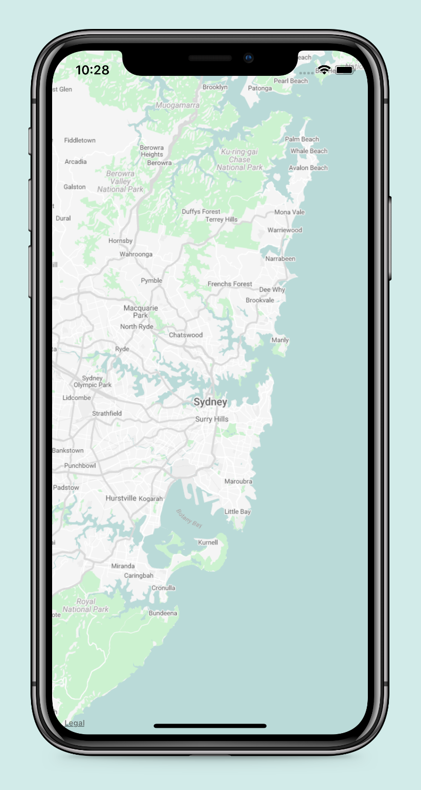
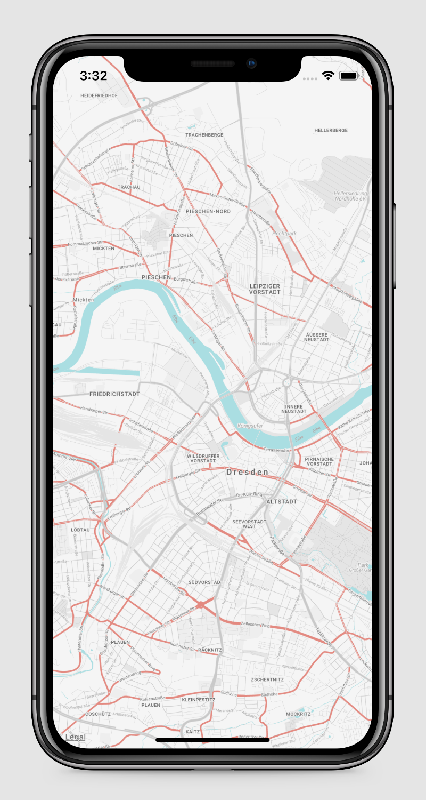
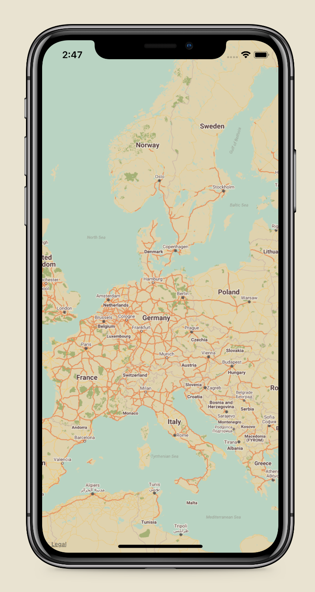
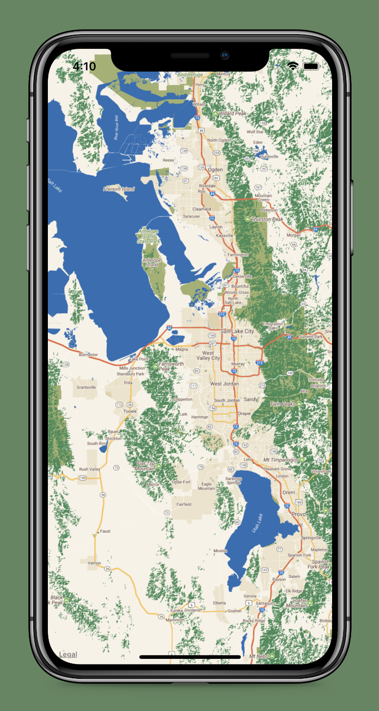
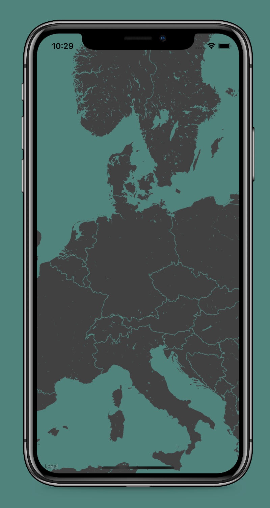

# GoogleMapsTileOverlay for MapKit


[](https://github.com/thepeaklab/GoogleMapsTileOverlay/blob/master/LICENSE)
[](https://twitter.com/thepeaklab)

GoogleMapsTileOverlay lets you customize Apple Maps [MKMapView](https://developer.apple.com/documentation/mapkit?changes=_8) with the [Google Maps StylingWizard](https://mapstyle.withgoogle.com).


## Install

### Carthage

To install `GoogleMapsTileOverlay ` with Carthage, setup Carthage for your project as described in the [Quick Start](https://github.com/Carthage/Carthage#quick-start).

Then add this line to your Cartfile:

```
github "thepeaklab/GoogleMapsTileOverlay" ~> 0.3.0
```

## Example
You can customize Apple Maps to match the design of your App or Game:

[Example Project](Example)

     

## Usage

1. Create MapStyle with the [Google Maps StylingWizard](https://mapstyle.withgoogle.com) and save it to a JSON-File
2. Add JSON-File to your XCode Project
3. In your ViewController: 

```swift
import GoogleMapsTileOverlay
```
 
#### Add custom overlay to your MKMapView:

```swift
guard let jsonURL = Bundle.main.url(forResource: "MapStyle", withExtension: "json") else { return }

let tileOverlay = try? GoogleMapsTileOverlay(jsonURL: jsonURL)
tileOverlay.canReplaceMapContent = true
mapView.add(tileOverlay)
```

#### Add delegate for your MKMapView:

```swift
mapView.delegate = self
```

```swift
extension YourViewController: MKMapViewDelegate {

    func mapView(_ mapView: MKMapView, rendererFor overlay: MKOverlay) -> MKOverlayRenderer {
        if let tileOverlay = overlay as? MKTileOverlay {
            return MKTileOverlayRenderer(tileOverlay: tileOverlay)
        }
        return MKOverlayRenderer(overlay: overlay)
    }
    
}
```

## Need Help?

Please [submit an issue](https://github.com/thepeaklab/GoogleMapsTileOverlay/issues) on GitHub.

## License

This project is licensed under the terms of the MIT license. See the [LICENSE](LICENSE) file.